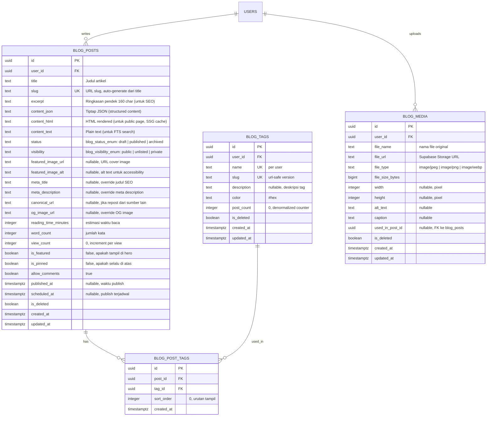

# Blog Feature Plan — SecondBrain Platform

> **Scope:** Personal blog publik di `zmaula.web.id` + Blog CMS di dashboard `app.zmaula.web.id`
> **Status:** Planning — belum diimplementasi

---

## 1. Arsitektur Domain & Routing

### 1.1 Domain Mapping

```
zmaula.web.id        → Blog publik (landing page, artikel, about)
app.zmaula.web.id    → Dashboard SecondBrain + Blog CMS
```

### 1.2 Strategi Routing — Next.js Middleware

Satu project Next.js, routing berdasarkan `hostname` di middleware:

```
src/middleware.ts
─────────────────────────────────────────
const hostname = request.headers.get('host')

JIKA hostname === 'zmaula.web.id'
  → rewrite ke /blog/* routes (publik, tanpa auth)
JIKA hostname === 'app.zmaula.web.id'
  → route ke /(dashboard)/* (auth required)
  → cek session, redirect ke /login jika belum auth
```

### 1.3 Folder Structure (Tambahan)

```
src/app/
├── (blog)/                          ← zmaula.web.id
│   ├── layout.tsx                   ← Blog layout (navbar, footer)
│   ├── page.tsx                     ← Landing page / beranda blog
│   ├── blog/
│   │   ├── page.tsx                 ← Blog listing + pagination
│   │   └── [slug]/page.tsx          ← Artikel detail (SSG/ISR)
│   ├── about/page.tsx               ← About me
│   ├── tags/
│   │   └── [tag]/page.tsx           ← Articles by tag
│   ├── feed.xml/route.ts            ← RSS Feed (Route Handler)
│   └── sitemap.ts                   ← Dynamic Sitemap
│
├── (dashboard)/
│   ├── ...existing...
│   ├── blog/                        ← Blog CMS di dashboard
│   │   ├── page.tsx                 ← Post list (draft/published)
│   │   ├── new/page.tsx             ← Create post (WYSIWYG editor)
│   │   ├── [id]/edit/page.tsx       ← Edit post
│   │   ├── tags/page.tsx            ← Tag management
│   │   └── media/page.tsx           ← Media library
│   └── ...
```

---

## 2. Database Schema (Tabel Baru — 4 Tabel)

### 2.1 Diagram Relasi



### 2.2 PostgreSQL ENUM Types (Tambahan)

```sql
CREATE TYPE blog_status_enum AS ENUM ('draft', 'published', 'archived');
CREATE TYPE blog_visibility_enum AS ENUM ('public', 'unlisted', 'private');
```

### 2.3 Indexes

```sql
-- Blog Posts
CREATE INDEX idx_blog_posts_user_id ON blog_posts(user_id);
CREATE INDEX idx_blog_posts_status ON blog_posts(status) WHERE is_deleted = false;
CREATE INDEX idx_blog_posts_slug ON blog_posts(slug) WHERE is_deleted = false;
CREATE INDEX idx_blog_posts_published ON blog_posts(published_at DESC) WHERE status = 'published' AND is_deleted = false;
CREATE INDEX idx_blog_posts_fts ON blog_posts USING GIN (to_tsvector('indonesian', content_text || ' ' || title));

-- Blog Tags
CREATE UNIQUE INDEX idx_blog_tags_user_slug ON blog_tags(user_id, slug) WHERE is_deleted = false;

-- Blog Post Tags
CREATE UNIQUE INDEX idx_blog_post_tags_unique ON blog_post_tags(post_id, tag_id);

-- Blog Media
CREATE INDEX idx_blog_media_user ON blog_media(user_id) WHERE is_deleted = false;
```

### 2.4 RLS Policies

```sql
-- blog_posts: owner can CRUD; anyone can READ published public posts
ALTER TABLE blog_posts ENABLE ROW LEVEL SECURITY;

CREATE POLICY "Owner full access" ON blog_posts
  FOR ALL USING (auth.uid() = user_id);
  
CREATE POLICY "Public can read published" ON blog_posts
  FOR SELECT USING (
    status = 'published' 
    AND visibility = 'public' 
    AND is_deleted = false
  );

-- blog_tags: owner only
ALTER TABLE blog_tags ENABLE ROW LEVEL SECURITY;
CREATE POLICY "Owner CRUD" ON blog_tags FOR ALL USING (auth.uid() = user_id);

-- blog_media: owner only
ALTER TABLE blog_media ENABLE ROW LEVEL SECURITY;
CREATE POLICY "Owner CRUD" ON blog_media FOR ALL USING (auth.uid() = user_id);
```

---

## 3. Blog Publik — Pages & Fitur

### 3.1 Landing Page (`zmaula.web.id`)

```
┌───────────────────────────────────────────────────┐
│  NAVBAR: Logo | Blog | About | Search             │
├───────────────────────────────────────────────────┤
│                                                   │
│  HERO SECTION                                     │
│  ┌─────────────────────────────────────────────┐  │
│  │  Featured Article (is_featured = true)      │  │
│  │  Cover Image + Title + Excerpt              │  │
│  │  Published Date + Reading Time + Tags       │  │
│  └─────────────────────────────────────────────┘  │
│                                                   │
│  RECENT POSTS (Grid 3 kolom, paginated)           │
│  ┌──────────┐ ┌──────────┐ ┌──────────┐          │
│  │  Card    │ │  Card    │ │  Card    │          │
│  │  Cover   │ │  Cover   │ │  Cover   │          │
│  │  Title   │ │  Title   │ │  Title   │          │
│  │  Excerpt │ │  Excerpt │ │  Excerpt │          │
│  │  Tags    │ │  Tags    │ │  Tags    │          │
│  └──────────┘ └──────────┘ └──────────┘          │
│                                                   │
│  POPULAR TAGS                                     │
│  [Next.js] [AI] [Web Dev] [Tutorial] [Review]     │
│                                                   │
│  NEWSLETTER SIGNUP (opsional)                     │
│                                                   │
│  FOOTER: Sosial Media Links | © 2026              │
└───────────────────────────────────────────────────┘
```

### 3.2 Artikel Detail (`zmaula.web.id/blog/[slug]`)

```
┌───────────────────────────────────────────────────┐
│  Breadcrumb: Blog > Tag > Judul Artikel           │
│                                                   │
│  TITLE (h1)                                       │
│  Author Avatar + Nama + Tanggal + ⏱ X min read   │
│                                                   │
│  COVER IMAGE (full width)                         │
│                                                   │
│    ┌──────────┐                                   │
│    │ TABLE OF │    ARTICLE BODY                    │
│    │ CONTENTS │    (rendered HTML dari content_html)│
│    │ (sticky) │    - Heading hierarchy             │
│    │          │    - Code blocks + syntax highlight│
│    │  1. xxx  │    - Images (lazy loaded)          │
│    │  2. xxx  │    - Embeds (YouTube, Twitter)     │
│    │  3. xxx  │    - Blockquotes, callouts         │
│    └──────────┘                                   │
│                                                   │
│  TAGS: [tag1] [tag2] [tag3]                       │
│                                                   │
│  SHARE BUTTONS: Twitter | LinkedIn | Copy Link    │
│                                                   │
│  ─── RELATED POSTS ───                            │
│  (3 artikel dengan tag serupa)                    │
│                                                   │
│  ─── AUTHOR BIO ───                               │
│  Avatar + Nama + Short Bio + Social Links         │
│                                                   │
│  FOOTER                                           │
└───────────────────────────────────────────────────┘
```

### 3.3 SEO Features (Otomatis)

| Feature | Implementasi |
|---------|-------------|
| **Meta Tags** | `generateMetadata()` per halaman → title, description, OG, Twitter Card |
| **JSON-LD** | Schema.org `Article`, `BlogPosting`, `BreadcrumbList`, `Person` |
| **Open Graph** | `og:title`, `og:description`, `og:image`, `og:type=article` |
| **Twitter Cards** | `twitter:card=summary_large_image` |
| **Sitemap** | Dynamic `sitemap.ts` → semua published posts + tagged pages |
| **RSS Feed** | `feed.xml/route.ts` → RSS 2.0 + Atom |
| **Canonical URL** | Auto dari slug, atau custom dari `canonical_url` field |
| **robots.txt** | Allow all, disallow drafts |
| **Table of Contents** | Auto-generate dari heading hierarchy di content |
| **Reading Time** | `Math.ceil(word_count / 200)` minutes |
| **Breadcrumbs** | JSON-LD BreadcrumbList + visual breadcrumb |
| **Slug Auto-gen** | Title → kebab-case, strip diacritics, unique check |
| **Structured Data** | `datePublished`, `dateModified`, `author`, `publisher` |

### 3.4 Blog Listing Page (`/blog`)

- **Pagination:** cursor-based (bukan offset) → `?cursor=<last_published_at>`
- **Sort:** Newest first (default), Most viewed
- **Filter:** By tag (via `/tags/[tag]`)
- **Search:** Full-text search via query param `?q=keyword`
- **Infinite scroll** ATAU numbered pagination (user choice)

---

## 4. Blog CMS — Dashboard Pages & Fitur

### 4.1 Post Management (`app.zmaula.web.id/blog`)

```
┌───────────────────────────────────────────────────┐
│  📝 Blog CMS                     + Tulisan Baru   │
├───────────────────────────────────────────────────┤
│  Filter: [Semua] [Draft] [Published] [Archived]   │
│  Search: [Cari judul atau konten...]              │
├───────────────────────────────────────────────────┤
│                                                   │
│  POST LIST (Table)                                │
│  ┌────────────────────────────────────────────┐   │
│  │ ☐  Judul Post        Status  Views  Tgl   │   │
│  │ ☐  Panduan Next.js   ●Pub    1.2K   2d    │   │
│  │ ☐  Draft tentang AI  ○Draft  -      5m    │   │
│  │ ☐  Review Produk X   ●Pub    340    1w    │   │
│  └────────────────────────────────────────────┘   │
│                                                   │
│  Bulk actions: Delete | Archive | Publish         │
│  Pagination                                       │
└───────────────────────────────────────────────────┘
```

### 4.2 WYSIWYG Editor (`/blog/new` & `/blog/[id]/edit`)

**Library: Novel (Tiptap-based, Notion-like)**

```
npm install novel @tiptap/starter-kit @tiptap/extension-image
         @tiptap/extension-link @tiptap/extension-code-block-lowlight
         @tiptap/extension-placeholder @tiptap/extension-table
         lowlight
```

**Editor Layout:**

```
┌───────────────────────────────────────────────────────────────┐
│  ← Kembali          Draft tersimpan 2 mnt lalu    [Publish ▾]│
├──────────────────────────────────────┬────────────────────────┤
│                                      │  SIDEBAR SETTINGS     │
│  COVER IMAGE                         │                       │
│  [Click to upload or drag & drop]    │  ── Publish ──        │
│                                      │  Status: [Draft ▾]    │
│  ─────────────────────────────────── │  Visibility: [Public] │
│                                      │  Scheduled: [Date]    │
│  TITLE (large, placeholder:          │                       │
│  "Judul artikel Anda...")            │  ── SEO ──            │
│                                      │  Meta Title: [...]    │
│  ─────────────────────────────────── │  Meta Desc: [...]     │
│                                      │  Slug: [auto/manual]  │
│  FLOATING EDITOR TOOLBAR             │  Canonical: [...]     │
│  B I U S H1 H2 H3 ▸ "" — ≡ <> 📷   │  OG Image: [upload]   │
│                                      │                       │
│  Start writing your story...         │  ── Tags ──           │
│                                      │  [Next.js] [x]        │
│  Editor natively supports:           │  [AI] [x]             │
│  - / slash commands                  │  + Add tag            │
│  - Markdown shortcuts                │                       │
│  - Drag to reorder blocks            │  ── Excerpt ──        │
│  - Image upload & resize             │  [Ringkasan pendek]   │
│  - Code blocks with syntax hl        │  0/160 chars          │
│  - Tables                            │                       │
│  - Embeds (YouTube, Twitter)         │  ── Preview ──        │
│  - Callout blocks                    │  [👁 Open Preview]    │
│  - Table of Contents auto            │                       │
│                                      │  ── Reading Stats ──  │
│                                      │  📖 1,234 words       │
│                                      │  ⏱  ~6 min read      │
│                                      │                       │
└──────────────────────────────────────┴────────────────────────┘
```

**Editor Features:**

| Feature | Detail |
|---------|--------|
| **Slash Commands** | Ketik `/` → menu dropdown: heading, image, code, table, callout, divider |
| **Markdown Shortcuts** | `# `, `## `, `**bold**`, `*italic*`, `` `code` ``, `> quote`, `- list` |
| **Drag & Drop Blocks** | Reorder paragraphs, images, code blocks |
| **Image Upload** | Drag/paste → auto upload ke Supabase Storage → insert URL |
| **Image Resize** | Drag handle untuk resize inline |
| **Code Blocks** | Syntax highlighting via lowlight (50+ bahasa) |
| **Tables** | Tiptap table extension |
| **Embeds** | YouTube, Twitter, CodePen → paste URL → auto embed |
| **Callout Blocks** | Info, Warning, Tip, Caution (mirip GitHub alerts) |
| **Auto-save** | Debounced 3 detik setelah berhenti mengetik |
| **Version History** | Setiap save simpan snapshot content_json (opsional Fase 2) |
| **AI Assist** | Select text → "Improve writing", "Make shorter", "Translate to EN" |

### 4.3 Tag Management (`/blog/tags`)

- CRUD tags dengan nama, slug, warna, deskripsi
- Lihat jumlah post per tag (denormalized `post_count`)
- Merge tags (gabungkan 2 tag menjadi 1)

### 4.4 Media Library (`/blog/media`)

- Grid gallery dari semua uploaded images
- Upload baru (drag & drop / file picker)
- Copy URL ke clipboard
- Delete media (soft delete, cek apakah masih digunakan)
- Filter: by type (image/video), by usage (used/unused)

---

## 5. CRUD Flow — Seluruh Sistem

### 5.1 Pola Umum: Server Actions + Zod + SWR

```
FLOW:
  UI (Client Component)
    → Server Action (src/actions/*.ts)
      → Zod validation
      → Supabase query (via createServerClient)
      → Return ActionResult<T>
    → SWR mutate (optimistic update / revalidate)
    → Toast notification (sonner)
```

### 5.2 Brain Notes CRUD

```
┌────────────────────────────────────────────────────────────────┐
│  ACTION              FUNCTION              VALIDATION          │
├────────────────────────────────────────────────────────────────┤
│  CREATE              createNote()          NoteCreateSchema     │
│    → title (required, max 200)                                │
│    → content_body (required)                                  │
│    → note_type (enum)                                         │
│    → contextual_role (enum)                                   │
│    → source_url (optional, valid URL)                         │
│    → is_pinned (optional, boolean)                            │
│    → category_ids (optional, uuid[])                          │
│    Server: INSERT brain_notes → INSERT item_categories        │
│    SWR: mutate('/api/notes')                                  │
│                                                               │
│  READ (List)         getNotes()            NoteFilterSchema    │
│    → role? (enum | 'all')                                     │
│    → type? (enum | 'all')                                     │
│    → time? ('today'|'7d'|'30d'|'month'|'all')                │
│    → search? (string, min 2 chars)                            │
│    → page? (number, default 1)                                │
│    Server: SELECT with filters, JOIN item_categories          │
│    SWR: useSWR('/api/notes?role=...&type=...')                │
│                                                               │
│  READ (Single)       getNote(id)           —                  │
│    Server: SELECT by id + categories                          │
│                                                               │
│  UPDATE              updateNote(id)        NoteUpdateSchema    │
│    → Partial<NoteCreateSchema>                                │
│    → category_ids (replace: DELETE old → INSERT new)          │
│    Server: UPDATE brain_notes SET ... WHERE id = $id          │
│    SWR: mutate('/api/notes', optimistic)                      │
│                                                               │
│  DELETE (Soft)       deleteNote(id)        —                  │
│    Server: UPDATE brain_notes SET is_deleted=true             │
│    SWR: mutate('/api/notes', optimistic filter)               │
│                                                               │
│  TOGGLE PIN          toggleNotePin(id)     —                  │
│    Server: UPDATE brain_notes SET is_pinned = NOT is_pinned   │
│    SWR: mutate optimistic                                     │
└────────────────────────────────────────────────────────────────┘
```

### 5.3 Tasks CRUD

```
┌────────────────────────────────────────────────────────────────┐
│  CREATE              createTask()          TaskCreateSchema     │
│    → title (required, max 200)                                │
│    → description (optional, max 1000)                         │
│    → status (enum, default 'todo')                            │
│    → priority (enum, default 'medium')                        │
│    → contextual_role (enum)                                   │
│    → due_date (optional, ISO date, >= today)                  │
│    → category_ids (optional)                                  │
│                                                               │
│  READ (List)         getTasks()            TaskFilterSchema    │
│    → status? (enum | 'all')                                   │
│    → priority? (enum | 'all')                                 │
│    → role? (enum | 'all')                                     │
│    → time? (range filter)                                     │
│    Server: SELECT, ORDER BY priority, due_date                │
│                                                               │
│  UPDATE              updateTask(id)        TaskUpdateSchema    │
│    → Partial<TaskCreateSchema>                                │
│    → Logika khusus:                                           │
│      status → 'done': SET completed_at = now()                │
│      status → 'todo'/'in_progress': SET completed_at = null   │
│                                                               │
│  DELETE (Soft)       deleteTask(id)        —                  │
│  TOGGLE STATUS       toggleTaskDone(id)    —                  │
│    status = 'done' → 'todo', atau sebaliknya                  │
│  REORDER             reorderTask(id, pos)  —                  │
│    Opsional: sort_order field untuk drag & drop               │
└────────────────────────────────────────────────────────────────┘
```

### 5.4 Habits CRUD

```
┌────────────────────────────────────────────────────────────────┐
│  CREATE              createHabit()         HabitCreateSchema   │
│    → name (required, max 100)                                 │
│    → frequency ('daily' | 'weekly')                           │
│    → contextual_role (enum)                                   │
│                                                               │
│  READ                getHabits()           —                  │
│    → is_active = true, JOIN habit_logs (last 14 days)         │
│                                                               │
│  UPDATE              updateHabit(id)       HabitUpdateSchema  │
│    → name, frequency, contextual_role                         │
│                                                               │
│  LOG (Check-in)      logHabit(id, date)    HabitLogSchema     │
│    → habit_id (uuid)                                          │
│    → log_date (date, ISO)                                     │
│    → is_completed (boolean, toggle)                           │
│    Server: UPSERT habit_logs                                  │
│            ON CONFLICT (habit_id, log_date)                   │
│            SET is_completed = $value                           │
│                                                               │
│  ARCHIVE             archiveHabit(id)      —                  │
│    Server: UPDATE SET is_active = false                       │
│                                                               │
│  DELETE (Soft)       deleteHabit(id)       —                  │
└────────────────────────────────────────────────────────────────┘
```

### 5.5 Calendar Events CRUD

```
┌────────────────────────────────────────────────────────────────┐
│  CREATE              createEvent()         EventCreateSchema   │
│    → title (required, max 200)                                │
│    → description (optional)                                   │
│    → start_at (required, ISO datetime)                        │
│    → end_at (optional, must be > start_at)                    │
│    → is_all_day (boolean)                                     │
│    → reminder_minutes (enum: null|0|5|15|30|60|1440)          │
│    → contextual_role (enum)                                   │
│    → recurrence (enum)                                        │
│    → category_ids (optional)                                  │
│    Server: INSERT → IF reminder → INSERT notification_queue   │
│                                                               │
│  READ (Range)        getEvents(start, end) EventRangeSchema   │
│    → start (ISO date)                                         │
│    → end (ISO date)                                           │
│    → role? (filter)                                           │
│    Server: WHERE start_at BETWEEN $start AND $end             │
│           OR recurrence != 'none' (expand recurrences)        │
│                                                               │
│  UPDATE              updateEvent(id)       EventUpdateSchema  │
│    → Partial<EventCreateSchema>                               │
│    → IF reminder changed → DELETE old notifs → INSERT new     │
│                                                               │
│  DELETE (Soft)       deleteEvent(id)       —                  │
│    → Also soft-delete related notification_queue entries       │
└────────────────────────────────────────────────────────────────┘
```

### 5.6 Academic Vault CRUD

```
┌────────────────────────────────────────────────────────────────┐
│  CREATE              createVaultItem()     VaultCreateSchema   │
│    → title (required, max 200)                                │
│    → description (optional)                                   │
│    → document_type (enum)                                     │
│    → semester (optional)                                      │
│    → mata_kuliah (optional)                                   │
│    PILIH SATU:                                                │
│      A. File upload → Supabase Storage                        │
│         → file (File, max 10MB, pdf/doc/docx/jpg/png)         │
│         → Server: upload → GET public URL → INSERT record     │
│      B. Google Drive link                                     │
│         → gdrive_url (valid drive.google.com URL)             │
│         → Server: extract gdrive_id → INSERT record           │
│                                                               │
│  READ (List)         getVaultItems()       VaultFilterSchema  │
│    → semester? (string | 'all')                               │
│    → mata_kuliah? (string | 'all')                            │
│    → document_type? (enum | 'all')                            │
│    → search? (string)                                         │
│    Server: SELECT with filters GROUP BY mata_kuliah           │
│                                                               │
│  UPDATE              updateVaultItem(id)   VaultUpdateSchema  │
│    → title, description, document_type, semester, mata_kuliah │
│    → File replacement (optional): delete old → upload new     │
│                                                               │
│  DELETE (Soft)       deleteVaultItem(id)   —                  │
│    → JANGAN hapus file dari Storage (keep for audit)          │
│                                                               │
│  DOWNLOAD            downloadFile(id)      —                  │
│    → Server: generate signed URL (60 min expiry)              │
│    → Return signed URL → browser download                     │
└────────────────────────────────────────────────────────────────┘
```

### 5.7 Blog Posts CRUD ★

```
┌────────────────────────────────────────────────────────────────┐
│  CREATE              createPost()          PostCreateSchema    │
│    → title (required, max 200)                                │
│    → content_json (Tiptap JSON, required)                     │
│    → content_html (rendered, required)                        │
│    → content_text (plain text, auto-extract)                  │
│    → excerpt (optional, max 160, auto-generate jika kosong)   │
│    → slug (auto from title, editable)                         │
│    → status (default 'draft')                                 │
│    → visibility (default 'public')                            │
│    → featured_image_url (optional)                            │
│    → featured_image_alt (optional)                            │
│    → meta_title (optional, default = title)                   │
│    → meta_description (optional, default = excerpt)           │
│    → tag_ids (optional, uuid[])                               │
│    → scheduled_at (optional, jika ingin schedule publish)     │
│    Server:                                                    │
│      1. Hitung word_count, reading_time_minutes               │
│      2. Generate slug jika kosong                             │
│      3. Validate slug unique                                  │
│      4. INSERT blog_posts                                     │
│      5. INSERT blog_post_tags                                 │
│      6. IF status='published' → SET published_at = now()      │
│    SWR: mutate('/api/blog/posts')                             │
│                                                               │
│  READ (CMS List)     getPosts()            PostFilterSchema   │
│    → status? ('draft'|'published'|'archived'|'all')           │
│    → search? (full-text via to_tsvector)                      │
│    → tag_id? (filter by tag)                                  │
│    → sort? ('newest'|'oldest'|'most_viewed'|'title')          │
│    → page, limit (cursor-based)                               │
│    Server: SELECT with filters, include tags, ORDER BY        │
│                                                               │
│  READ (Public List)  getPublishedPosts()   PublicListSchema   │
│    → Hanya status='published' AND visibility='public'         │
│    → cursor? (published_at cursor for pagination)             │
│    → tag? (filter by tag slug)                                │
│    → q? (full-text search)                                    │
│    Server: SELECT tanpa auth (via RLS public policy)          │
│    Caching: ISR revalidate = 60 seconds                       │
│                                                               │
│  READ (Public Detail) getPostBySlug(slug)  —                  │
│    → Server: SELECT WHERE slug = $slug                        │
│    → Increment view_count (via separate UPDATE, debounced)    │
│    → Return: post + tags + related posts (same tags)          │
│    Caching: ISR revalidate = 60, on-demand revalidation       │
│                                                               │
│  UPDATE              updatePost(id)        PostUpdateSchema   │
│    → Partial<PostCreateSchema>                                │
│    → tag_ids: DELETE old → INSERT new                         │
│    → IF status changed to 'published' AND published_at null   │
│      → SET published_at = now()                               │
│    → IF content changed → recompute word_count, reading_time  │
│    → IF slug changed → validate unique                        │
│    → Trigger ISR revalidation: revalidatePath('/blog/[slug]') │
│                                                               │
│  DELETE (Soft)       deletePost(id)        —                  │
│    → SET is_deleted = true                                    │
│    → Trigger ISR revalidation                                 │
│                                                               │
│  PUBLISH             publishPost(id)       —                  │
│    → SET status='published', published_at=now()               │
│    → Trigger ISR revalidation                                 │
│                                                               │
│  UNPUBLISH           unpublishPost(id)     —                  │
│    → SET status='draft'                                       │
│    → Trigger ISR revalidation                                 │
│                                                               │
│  ARCHIVE             archivePost(id)       —                  │
│    → SET status='archived'                                    │
│    → Trigger ISR revalidation                                 │
│                                                               │
│  SCHEDULE            schedulePost(id, dt)  ScheduleSchema     │
│    → SET scheduled_at = $datetime                             │
│    → pg_cron: check scheduled_at <= now() → auto publish      │
│                                                               │
│  AUTO-SAVE           autoSavePost(id)      —                  │
│    → Debounced 3s setelah berhenti ketik                      │
│    → UPDATE content_json, content_html, content_text          │
│    → Return: { saved_at: ISO }                                │
│                                                               │
│  DUPLICATE           duplicatePost(id)     —                  │
│    → Copy seluruh field, title += " (Copy)", slug += "-copy"  │
│    → SET status='draft', published_at=null                    │
└────────────────────────────────────────────────────────────────┘
```

### 5.8 Blog Tags CRUD

```
┌────────────────────────────────────────────────────────────────┐
│  CREATE              createTag()           TagCreateSchema     │
│    → name (required, max 50, unique per user)                 │
│    → slug (auto from name)                                    │
│    → description (optional, max 200)                          │
│    → color (hex, default random)                              │
│                                                               │
│  READ                getTags()             —                  │
│    → ORDER BY post_count DESC                                 │
│    → Include post_count (denormalized)                        │
│                                                               │
│  UPDATE              updateTag(id)         TagUpdateSchema    │
│    → name, slug, description, color                           │
│    → IF name changed → regenerate slug, update tag page       │
│                                                               │
│  DELETE (Soft)       deleteTag(id)         —                  │
│    → SET is_deleted = true                                    │
│    → DELETE related blog_post_tags entries                     │
│    → Decrement post_count on affected posts                   │
│                                                               │
│  MERGE               mergeTags(from, to)   MergeTagSchema     │
│    → UPDATE blog_post_tags SET tag_id=$to WHERE tag_id=$from  │
│    → Recalculate post_count on target tag                     │
│    → Soft delete source tag                                   │
└────────────────────────────────────────────────────────────────┘
```

### 5.9 Blog Media CRUD

```
┌────────────────────────────────────────────────────────────────┐
│  UPLOAD              uploadMedia()         MediaUploadSchema  │
│    → file (required, max 5MB, image/* only)                   │
│    → alt_text (optional)                                      │
│    → caption (optional)                                       │
│    Server:                                                    │
│      1. Validate file type & size                             │
│      2. Generate unique filename (uuid + extension)           │
│      3. IF jpeg/png AND > 500KB → compress to webp            │
│      4. Upload ke Supabase Storage (bucket: 'blog-media')     │
│      5. Get image dimensions (width, height)                  │
│      6. INSERT blog_media record                              │
│      7. Return: { url, id, width, height }                    │
│                                                               │
│  READ (Gallery)      getMedia()            MediaFilterSchema  │
│    → sort? ('newest'|'oldest'|'size')                         │
│    → used? ('all'|'used'|'unused')                            │
│    → page, limit                                              │
│                                                               │
│  UPDATE              updateMedia(id)       MediaUpdateSchema  │
│    → alt_text, caption                                        │
│                                                               │
│  DELETE (Soft)       deleteMedia(id)       —                  │
│    → Cek apakah masih digunakan di post                       │
│    → Jika used: confirm dialog → "Media ini digunakan di X"   │
│    → SET is_deleted = true                                    │
│    → JANGAN hapus file dari Storage (avoid broken image)      │
└────────────────────────────────────────────────────────────────┘
```

### 5.10 Categories CRUD (Existing — Dokumentasi)

```
┌────────────────────────────────────────────────────────────────┐
│  CREATE              createCategory()      CategorySchema     │
│    → name (required, max 50, unique per user)                 │
│    → color (hex)                                              │
│    → icon (emoji)                                             │
│    → contextual_role (enum)                                   │
│                                                               │
│  READ                getCategories()       —                  │
│    → WHERE user_id AND is_deleted=false                       │
│    → ORDER BY contextual_role, name                           │
│                                                               │
│  UPDATE              updateCategory(id)    CategorySchema     │
│  DELETE (Soft)       deleteCategory(id)    —                  │
│    → Also DELETE related item_categories                      │
└────────────────────────────────────────────────────────────────┘
```

### 5.11 Notifications CRUD

```
┌────────────────────────────────────────────────────────────────┐
│  CREATE              Internal only — via triggers/cron        │
│    → task due date → INSERT notif 1 day before                │
│    → habit daily → INSERT notif at 20:00                      │
│    → calendar event → INSERT notif at (start - reminder_min)  │
│                                                               │
│  READ                getNotifications()    —                  │
│    → WHERE user_id, ORDER BY scheduled_at DESC                │
│    → Status: pending (belum kirim), sent, failed              │
│                                                               │
│  MARK READ           No explicit read status (by design)      │
│    → Notif dianggap "read" setelah dikirim                    │
│                                                               │
│  SEND (Cron)         processNotifications()                   │
│    → pg_cron setiap 1 menit:                                  │
│      SELECT * FROM notification_queue                         │
│        WHERE status='pending' AND scheduled_at <= now()       │
│      → channel='telegram' → Telegram Bot API                  │
│      → channel='push' → Web Push API                          │
│      → UPDATE SET status='sent', sent_at=now()                │
│      → IF error → retry_count++, IF retry_count>=3 → 'failed' │
└────────────────────────────────────────────────────────────────┘
```

---

## 6. Zod Validation Schemas (Reference)

```typescript
// src/lib/validations/blog.ts
import { z } from 'zod';

export const PostCreateSchema = z.object({
  title: z.string().min(1).max(200),
  content_json: z.any(), // Tiptap JSON
  content_html: z.string().min(1),
  excerpt: z.string().max(160).optional(),
  slug: z.string().regex(/^[a-z0-9-]+$/).max(200).optional(),
  status: z.enum(['draft', 'published']).default('draft'),
  visibility: z.enum(['public', 'unlisted', 'private']).default('public'),
  featured_image_url: z.string().url().optional(),
  featured_image_alt: z.string().max(200).optional(),
  meta_title: z.string().max(70).optional(),
  meta_description: z.string().max(160).optional(),
  canonical_url: z.string().url().optional(),
  tag_ids: z.array(z.string().uuid()).optional(),
  scheduled_at: z.string().datetime().optional(),
});

export const PostUpdateSchema = PostCreateSchema.partial();

export const TagCreateSchema = z.object({
  name: z.string().min(1).max(50),
  description: z.string().max(200).optional(),
  color: z.string().regex(/^#[0-9a-fA-F]{6}$/).optional(),
});

// src/lib/validations/notes.ts
export const NoteCreateSchema = z.object({
  title: z.string().min(1).max(200),
  content_body: z.string().min(1),
  note_type: z.enum(['text', 'link', 'idea', 'snippet']),
  contextual_role: z.enum(['dosen','creator','affiliate','consultant','general']),
  source_url: z.string().url().optional(),
  is_pinned: z.boolean().optional(),
  category_ids: z.array(z.string().uuid()).optional(),
});

// src/lib/validations/tasks.ts
export const TaskCreateSchema = z.object({
  title: z.string().min(1).max(200),
  description: z.string().max(1000).optional(),
  status: z.enum(['todo', 'in_progress', 'done']).default('todo'),
  priority: z.enum(['low', 'medium', 'high', 'urgent']).default('medium'),
  contextual_role: z.enum(['dosen','creator','affiliate','consultant','general']),
  due_date: z.string().date().optional(),
  category_ids: z.array(z.string().uuid()).optional(),
});

// src/lib/validations/habits.ts
export const HabitCreateSchema = z.object({
  name: z.string().min(1).max(100),
  frequency: z.enum(['daily', 'weekly']),
  contextual_role: z.enum(['dosen','creator','affiliate','consultant','general']),
});

export const HabitLogSchema = z.object({
  habit_id: z.string().uuid(),
  log_date: z.string().date(),
  is_completed: z.boolean(),
});

// src/lib/validations/events.ts
export const EventCreateSchema = z.object({
  title: z.string().min(1).max(200),
  description: z.string().max(1000).optional(),
  start_at: z.string().datetime(),
  end_at: z.string().datetime().optional(),
  is_all_day: z.boolean().default(false),
  reminder_minutes: z.enum(['0','5','15','30','60','1440']).transform(Number).optional(),
  contextual_role: z.enum(['dosen','creator','affiliate','consultant','general']),
  recurrence: z.enum(['none','daily','weekly','monthly']).default('none'),
  category_ids: z.array(z.string().uuid()).optional(),
}).refine(
  (data) => !data.end_at || new Date(data.end_at) > new Date(data.start_at),
  { message: 'end_at harus setelah start_at', path: ['end_at'] }
);

// src/lib/validations/vault.ts
export const VaultCreateSchema = z.object({
  title: z.string().min(1).max(200),
  description: z.string().max(500).optional(),
  document_type: z.enum(['rps','silabus','jurnal','sk','sertifikat','materi_ajar','administratif','lainnya']),
  semester: z.string().optional(),
  mata_kuliah: z.string().optional(),
  // File upload OR gdrive link (validated separately)
});
```

---

## 7. Implementasi Timeline

```
Fase 1A ✅ DONE  — Foundation (types, constants, mock data, utilities)
Fase 1B ✅ DONE  — Frontend UI (all pages, widgets, components)

Fase 2A 🔜       — Supabase Setup
                    → Tables, enums, triggers, RLS policies
                    → Supabase clients (browser, server, middleware)
                    → Zod validation schemas

Fase 2B           — Server Actions (CRUD — All Modules)
                    → Notes, Tasks, Habits, Calendar, Vault
                    → SWR hooks replacing mock data
                    → Auth middleware (session refresh)

Fase 2C           — AI Integration
                    → Opencode Go API wrapper
                    → System prompts
                    → Draft → Confirm flow (real)
                    → Telegram Bot webhook

Fase 3A           — Blog Schema & CMS Backend
                    → blog_posts, blog_tags, blog_media tables
                    → Server Actions (CRUD blog)
                    → Tiptap/Novel editor integration
                    → Media upload pipeline

Fase 3B           — Blog Public Frontend
                    → Landing page (zmaula.web.id)
                    → Artikel detail (ISR)
                    → Tag pages, search
                    → SEO: sitemap, RSS, JSON-LD, OG
                    → Middleware domain routing

Fase 3C           — Polish & Deploy
                    → Notification system (pg_cron)
                    → Scheduled post publishing
                    → Performance optimization
                    → Vercel deployment with domain mapping
```

---

## 8. Dependency Baru (untuk Blog)

```bash
# WYSIWYG Editor
npm install novel @tiptap/react @tiptap/starter-kit
npm install @tiptap/extension-image @tiptap/extension-link
npm install @tiptap/extension-code-block-lowlight
npm install @tiptap/extension-placeholder @tiptap/extension-table
npm install lowlight

# RSS Feed
npm install rss

# Slug generation
npm install slugify

# Reading time
# → custom utility (word_count / 200), no package needed

# Image processing (server-side)
npm install sharp
```
