# PRD v4: AI Personal Dashboard & Second Brain

> **Revisi v3:** Semua 8 gap dari validasi putaran 3 telah ditambal.
> Keputusan arsitektural: Multi-category (N:N), Supabase pg_cron, AI Usage Tracking di MVP, Onboarding dengan default categories.
> **Revisi v4 (2026-04-27):** Sinkronisasi dengan implementasi aktual. Menambahkan kontrak detail untuk Settings, Telegram Bot, Notification Center, service-role cron/webhook, environment variables, dan acceptance criteria end-to-end.

---

## 1. Filosofi Sistem

### 1.1 Cognitive Efficiency (Efisiensi Pikiran)
Pengguna memiliki 4 peran aktif (Dosen, Kreator Produk Digital, Afiliator TikTok, Konsultan Bisnis). Sistem ini adalah **satu pintu masuk** untuk semua peran tersebut. Prinsip utama:
- **Satu input, banyak output.** Ketik sekali di Hub, AI yang memilah ke mana data pergi.
- **Draft → Confirm.** AI menyarankan, manusia memutuskan. Tidak ada penyimpanan tanpa persetujuan.
- **Zero navigation depth.** Semua fitur utama terlihat dalam 1 layar (Bento Grid). Tidak ada menu berlapis.

### 1.2 SWR (Stale-While-Revalidate)
Setiap layar menggunakan SWR untuk memastikan:
- UI merespons dalam 0ms (optimistic update).
- Data selalu segar saat tab di-fokuskan kembali (`revalidateOnFocus: true`).
- Rollback otomatis jika server menolak mutasi.

### 1.3 Timezone Awareness
- Semua data disimpan dalam `TIMESTAMPTZ` (UTC) di PostgreSQL.
- User default timezone: `Asia/Jakarta` (UTC+7), tersimpan di `users.preferences.timezone`.
- AI System Prompt di-inject timezone user agar parsing *"besok jam 10"* tepat.
- Frontend menampilkan waktu dalam timezone lokal menggunakan `date-fns-tz`.
- Semua filter waktu query timezone-aware:
```sql
WHERE created_at >= (CURRENT_DATE AT TIME ZONE 'Asia/Jakarta')
  AND created_at < (CURRENT_DATE AT TIME ZONE 'Asia/Jakarta') + interval '1 day'
```

---

## 2. Scope MVP vs Fase 2

### ✅ MVP (Fase 1) — Dibangun Sekarang
| Modul | Deskripsi |
|-------|-----------|
| AI Command Hub | Chat in-app + Telegram Bot. AI parsing via Opencode Go. Draft → Confirm flow. |
| Second Brain (Notes) | Repositori catatan, ide, link. Multi-tag oleh AI. |
| Dynamic Categories | Sistem kategori/tag multi-relasi (N:N). Bisa diciptakan AI atau manual. |
| Academic Vault | Repositori RPS, silabus, jurnal. Upload PDF/DOC/JPG + Google Drive link. |
| Task Management | Todo list dengan prioritas, due date, dan role context. |
| Habit Tracker | Kebiasaan harian/mingguan dengan matrix visual. |
| Calendar Events | Event terjadwal hasil parsing AI atau input manual. |
| Notification System | Push notification (PWA) + Telegram notification. Cron via Supabase `pg_cron`. |
| Global Search (Cmd+K) | Pencarian lintas modul menggunakan Supabase Full-Text Search. |
| Audit & Logging | Jejak semua perubahan data via DB triggers + AI interaction logs. |
| AI Usage Tracking | Kolom `token_used` dan `latency_ms` di `ai_hub_logs`. Widget di Settings. |
| Onboarding Flow | 3 langkah: pilih peran → link Telegram → mulai. Auto-create default categories. |

### ⏸️ Fase 2 — Ditunda
| Modul | Alasan Tunda |
|-------|-------------|
| Affiliate Pipeline Tracker | Cukup gunakan `brain_notes` + tag `#affiliate` untuk MVP. |
| Digital Product Ideation Board | Cukup gunakan `brain_notes` + tag `#product-idea` untuk MVP. |
| Client CRM | Belum dibutuhkan saat ini. |
| Weekly AI Digest | Rangkuman mingguan otomatis via Telegram. |
| Browser Extension Quick Capture | Tangkap konten web 1-klik ke brain_notes. |
| Note Linking (Zettelkasten) | Hubungkan catatan A ↔ B membentuk knowledge graph. |
| Voice Input | Rekam suara → transkripsi → AI parser. |
| Export Markdown (Notion/Obsidian) | Backup second brain ke format standar. |

---

## 3. Entity-Relationship Diagram (ERD Lengkap — 12 Tabel)

### 3.1 Kolom Standar (Wajib di Semua Tabel Data)

| Kolom | Tipe | Fungsi |
|-------|------|--------|
| `id` | `UUID DEFAULT gen_random_uuid()` | Primary Key |
| `user_id` | `UUID REFERENCES auth.users(id)` | Foreign Key, basis RLS |
| `created_at` | `TIMESTAMPTZ DEFAULT now()` | Kapan record dibuat |
| `updated_at` | `TIMESTAMPTZ DEFAULT now()` | Kapan terakhir diubah (auto-update via trigger) |
| `is_deleted` | `BOOLEAN DEFAULT false` | Soft delete — tidak pernah `DELETE FROM` |

> **Trigger `updated_at`:** PostgreSQL trigger function `handle_updated_at()` otomatis meng-update kolom ini setiap kali `UPDATE` terjadi. Dipasang di **semua tabel**.

### 3.2 Diagram Relasi

```mermaid
erDiagram
    USERS ||--o{ AI_HUB_LOGS : creates
    USERS ||--o{ BRAIN_NOTES : owns
    USERS ||--o{ ACADEMIC_VAULT : owns
    USERS ||--o{ TASKS : owns
    USERS ||--o{ HABITS : owns
    USERS ||--o{ CALENDAR_EVENTS : owns
    USERS ||--o{ CATEGORIES : owns
    USERS ||--o{ NOTIFICATION_QUEUE : receives

    HABITS ||--o{ HABIT_LOGS : tracks

    CATEGORIES ||--o{ ITEM_CATEGORIES : tagged_in
    BRAIN_NOTES ||--o{ ITEM_CATEGORIES : tagged_with
    TASKS ||--o{ ITEM_CATEGORIES : tagged_with
    ACADEMIC_VAULT ||--o{ ITEM_CATEGORIES : tagged_with
    CALENDAR_EVENTS ||--o{ ITEM_CATEGORIES : tagged_with

    USERS {
        uuid id PK
        text email UK
        text full_name
        text telegram_chat_id UK
        jsonb preferences "timezone, theme, locale, onboarding_completed"
        timestamptz created_at
        timestamptz updated_at
    }

    CATEGORIES {
        uuid id PK
        uuid user_id FK
        text name UK "per user"
        text color "#hex"
        text icon "emoji atau icon name"
        text contextual_role "role_context_enum"
        boolean is_system "false - true jika auto-created saat onboarding"
        boolean is_deleted
        timestamptz created_at
        timestamptz updated_at
    }

    ITEM_CATEGORIES {
        uuid id PK
        uuid item_id "FK polimorfik ke brain_notes/tasks/vault/calendar"
        text item_type "item_type_enum"
        uuid category_id FK
        timestamptz created_at
    }

    AI_HUB_LOGS {
        uuid id PK
        uuid user_id FK
        text source "in_app | telegram"
        bigint telegram_message_id UK "idempotency key"
        text raw_input
        jsonb ai_response "Full JSON dari Opencode Go"
        text status "pending | draft | confirmed | failed"
        text error_message "null jika sukses"
        integer tokens_used "nullable, dari response header API"
        integer latency_ms "nullable, durasi panggilan API"
        timestamptz created_at
        timestamptz updated_at
    }

    BRAIN_NOTES {
        uuid id PK
        uuid user_id FK
        text title
        text content_body
        text note_type "note_type_enum"
        text contextual_role "role_context_enum"
        text attachment_url "nullable, Supabase Storage URL"
        text attachment_type "nullable: pdf | jpg | doc"
        bigint attachment_size_bytes "nullable"
        text source_url "nullable, URL eksternal original"
        text ai_summary "nullable, rangkuman otomatis"
        boolean is_pinned "false"
        boolean is_deleted
        timestamptz created_at
        timestamptz updated_at
    }

    ACADEMIC_VAULT {
        uuid id PK
        uuid user_id FK
        text title
        text description
        text document_type "academic_doc_enum"
        text file_format "file_format_enum"
        text file_url "Supabase Storage URL atau GDrive URL"
        text gdrive_id "nullable, extracted dari URL"
        bigint file_size_bytes "nullable, untuk tracking storage"
        text ai_summary "nullable"
        text semester "nullable, contoh: Genap 2025/2026"
        text mata_kuliah "nullable"
        boolean is_deleted
        timestamptz created_at
        timestamptz updated_at
    }

    TASKS {
        uuid id PK
        uuid user_id FK
        text title
        text description "nullable"
        text status "task_status_enum"
        text priority "priority_enum"
        text contextual_role "role_context_enum"
        date due_date "nullable"
        timestamptz completed_at "nullable, diisi saat status=done"
        boolean is_deleted
        timestamptz created_at
        timestamptz updated_at
    }

    HABITS {
        uuid id PK
        uuid user_id FK
        text name
        text frequency "habit_freq_enum"
        text contextual_role "role_context_enum"
        boolean is_active "true"
        boolean is_deleted
        timestamptz created_at
        timestamptz updated_at
    }

    HABIT_LOGS {
        uuid id PK
        uuid habit_id FK
        date log_date
        boolean is_completed
        timestamptz created_at
    }

    CALENDAR_EVENTS {
        uuid id PK
        uuid user_id FK
        text title
        text description "nullable"
        timestamptz start_at
        timestamptz end_at "nullable"
        boolean is_all_day "false"
        integer reminder_minutes "nullable, 0/5/15/30/60/1440"
        text contextual_role "role_context_enum"
        text recurrence "recurrence_enum"
        boolean is_deleted
        timestamptz created_at
        timestamptz updated_at
    }

    NOTIFICATION_QUEUE {
        uuid id PK
        uuid user_id FK
        text channel "notification_channel_enum"
        text title
        text body
        text reference_type "nullable: task | habit | calendar | system"
        uuid reference_id "nullable, FK polimorfik"
        timestamptz scheduled_at
        timestamptz sent_at "nullable, diisi saat berhasil kirim"
        text status "notif_status_enum"
        text error_message "nullable"
        integer retry_count "0, max 3"
        timestamptz created_at
    }

    AUDIT_LOGS {
        uuid id PK
        uuid user_id FK
        text table_name
        uuid record_id
        text action "audit_action_enum"
        jsonb old_data "nullable, snapshot sebelum"
        jsonb new_data "nullable, snapshot sesudah"
        text ip_address "nullable"
        text user_agent "nullable"
        timestamptz created_at
    }
```



### 3.3 PostgreSQL ENUM Types

```sql
CREATE TYPE role_context_enum AS ENUM (
  'dosen', 'creator', 'affiliate', 'consultant', 'general'
);
CREATE TYPE task_status_enum AS ENUM ('todo', 'in_progress', 'done');
CREATE TYPE priority_enum AS ENUM ('low', 'medium', 'high', 'urgent');
CREATE TYPE academic_doc_enum AS ENUM (
  'rps', 'silabus', 'jurnal', 'sk', 'sertifikat', 'materi_ajar', 'administratif', 'lainnya'
);
CREATE TYPE file_format_enum AS ENUM ('pdf', 'doc', 'docx', 'jpg', 'jpeg', 'png', 'gdrive_link');
CREATE TYPE note_type_enum AS ENUM ('text', 'link', 'idea', 'snippet');
CREATE TYPE habit_freq_enum AS ENUM ('daily', 'weekly');
CREATE TYPE notification_channel_enum AS ENUM ('push', 'telegram');
CREATE TYPE notif_status_enum AS ENUM ('pending', 'sent', 'failed');
CREATE TYPE audit_action_enum AS ENUM ('create', 'update', 'soft_delete', 'restore');
CREATE TYPE recurrence_enum AS ENUM ('none', 'daily', 'weekly', 'monthly');
CREATE TYPE item_type_enum AS ENUM ('brain_note', 'task', 'academic_vault', 'calendar_event');
```

---

## 4. AI System Prompt Specification

### 4.1 Master System Prompt (`lib/ai/prompts.ts`)
```
Kamu adalah asisten pribadi cerdas untuk seorang profesional multi-peran.
Tugasmu: mengekstrak perintah user menjadi JSON terstruktur.

ATURAN KETAT:
1. Output HANYA JSON valid, tanpa markdown, tanpa penjelasan tambahan.
2. Setiap perintah bisa menghasilkan 1 atau BANYAK item sekaligus dalam array "items".
3. Jika mendeteksi tanggal/waktu → WAJIB buat entry CALENDAR. Jika juga mengandung tugas, buat TASK juga.
4. Jika konten berupa URL → deteksi sumbernya:
   - drive.google.com → action: ACADEMIC, file_format: gdrive_link
   - tiktok.com / vt.tiktok → action: NOTE, role: affiliate
   - URL lain → action: NOTE
5. Jika tidak ada kategori yang cocok dari daftar user, isi "suggested_new_category" dengan nama yang ringkas dan deskriptif.
6. Jika user mengetik perintah kasual (misal: "halo", "apa kabar"), isi items sebagai array kosong dan berikan respon ramah di "ai_message".
7. priority default: "medium" kecuali ada indikasi urgensi ("urgent", "segera", "ASAP", "penting banget").

KONTEKS DINAMIS:
- WAKTU SEKARANG: {{current_datetime_iso}}
- TIMEZONE: {{user_timezone}} ({{utc_offset}})
- KATEGORI MILIK USER: {{user_categories_json}}
- PERAN AKTIF USER: {{user_active_roles}}

OUTPUT SCHEMA:
{
  "items": [
    {
      "action": "TASK" | "NOTE" | "CALENDAR" | "ACADEMIC",
      "data": {
        "title": "string",
        "description": "string | null",
        "contextual_role": "dosen" | "creator" | "affiliate" | "consultant" | "general",
        "category_names": ["string"],
        "suggested_new_category": "string | null",
        "due_date": "ISO8601 | null",
        "start_at": "ISO8601 | null",
        "end_at": "ISO8601 | null",
        "priority": "low" | "medium" | "high" | "urgent",
        "source_url": "string | null",
        "file_format": "string | null",
        "reminder_minutes": 15,
        "semester": "string | null",
        "mata_kuliah": "string | null"
      }
    }
  ],
  "ai_message": "string - pesan singkat untuk ditampilkan ke user"
}
```

### 4.2 Contoh Input/Output

**Input:** *"Besok jam 10 ingetin ngurus RPS Algo, dan catat ide hook FOMO untuk TikTok"*

**Output:**
```json
{
  "items": [
    {
      "action": "CALENDAR",
      "data": {
        "title": "Ngurus RPS Algo",
        "contextual_role": "dosen",
        "category_names": ["Akademik"],
        "start_at": "2026-04-17T10:00:00+07:00",
        "end_at": "2026-04-17T11:00:00+07:00",
        "reminder_minutes": 15,
        "priority": "medium"
      }
    },
    {
      "action": "TASK",
      "data": {
        "title": "Ngurus RPS Algoritma",
        "contextual_role": "dosen",
        "category_names": ["Akademik"],
        "due_date": "2026-04-17",
        "priority": "medium",
        "mata_kuliah": "Algoritma"
      }
    },
    {
      "action": "NOTE",
      "data": {
        "title": "Ide Hook FOMO untuk TikTok",
        "description": "Eksplorasi teknik hook FOMO dalam konten TikTok",
        "contextual_role": "affiliate",
        "category_names": ["Konten TikTok"],
        "suggested_new_category": null,
        "priority": "medium"
      }
    }
  ],
  "ai_message": "Saya buatkan 3 item: 1 event kalender besok jam 10, 1 task untuk RPS Algo, dan 1 catatan ide hook FOMO. Silakan review dan simpan."
}
```

---

## 5. Strategi Timestamp, Filtering & Querying

### 5.1 Filter Waktu Standar (Semua Modul, Timezone-Aware)

| Filter | Query PostgreSQL |
|--------|-----------------|
| Hari ini | `WHERE created_at >= (CURRENT_DATE AT TIME ZONE $tz) AND created_at < (CURRENT_DATE AT TIME ZONE $tz) + interval '1 day'` |
| 7 hari terakhir | `WHERE created_at >= (now() AT TIME ZONE $tz - interval '7 days')` |
| 30 hari terakhir | `WHERE created_at >= (now() AT TIME ZONE $tz - interval '30 days')` |
| Bulan ini | `WHERE date_trunc('month', created_at AT TIME ZONE $tz) = date_trunc('month', now() AT TIME ZONE $tz)` |
| Range kustom | `WHERE created_at BETWEEN $start AND $end` |
| Semua | Tanpa filter tanggal |

Setiap query WAJIB menyertakan: `AND is_deleted = false AND user_id = auth.uid()`.

### 5.2 Filter Konteks per Modul

| Modul | Filter Tersedia | Default |
|-------|----------------|---------|
| Brain Notes | Role, Categories (multi), Note Type, Pinned, Waktu | Semua, Terbaru |
| Academic Vault | Document Type, Semester, Mata Kuliah, File Format, Categories, Waktu | Semua, Terbaru |
| Tasks | Status, Priority, Role, Categories, Due Date, Waktu | Status: todo+in_progress |
| Habits | Frequency, Role, Active/Inactive | Active only |
| Calendar | Role, Recurrence, Categories, Waktu (range kalender) | Bulan ini |
| AI Hub Logs | Source, Status, Waktu | 7 hari terakhir |
| Audit Logs | Table, Action, Waktu | 7 hari terakhir |
| Notifications | Channel, Status, Waktu | Pending |

### 5.3 Sortir Default
- **General:** `ORDER BY created_at DESC`
- **Tasks:** `ORDER BY priority DESC, due_date ASC NULLS LAST`
- **Calendar Events:** `ORDER BY start_at ASC`
- **Habit Logs:** `ORDER BY log_date DESC`

### 5.4 Pagination (Cursor-based)
```sql
WHERE created_at < $cursor_timestamp
ORDER BY created_at DESC
LIMIT 20
```

---

## 6. Sistem File (PDF, DOC, JPG, Google Drive)

### 6.1 Upload Flow
```
User pilih file / paste URL
        │
        ▼
┌─────────────────────────────┐
│ Deteksi tipe input          │
│ isGoogleDriveLink()?        │
└────┬────────────┬───────────┘
     │ YES        │ NO (file fisik)
     ▼            ▼
Extract       Validasi:
Drive ID      - Max 10MB (JPG: compress ke <500KB dulu)
& embed URL   - Ekstensi: pdf/doc/docx/jpg/jpeg/png
     │            │
     │            ▼
     │         Upload ke Supabase Storage
     │         Path: vault/{user_id}/{uuid}-{filename}
     │            │
     ▼            ▼
┌─────────────────────────────┐
│ Server Action (transaction) │
│ 1. INSERT academic_vault    │
│ 2. INSERT item_categories   │
│ 3. audit_logs via trigger   │
└─────────────────────────────┘
```

### 6.2 Cleanup Strategy
Jika upload ke Storage berhasil TAPI insert ke DB gagal:
1. Server menangkap error.
2. Server `supabase.storage.from('documents').remove([path])`.
3. Log error ke console (audit trigger tidak berjalan karena DB insert gagal).

### 6.3 Storage Management
- **Free tier limit:** 1GB Supabase Storage.
- JPG di-compress client-side (canvas API target < 500KB).
- File > 5MB → UI menyarankan Google Drive link sebagai alternatif.
- Settings page menampilkan **Storage Usage Widget** (SUM `file_size_bytes`).

---

## 7. Logging Architecture

### 7.1 Tiga Layer Logging

| Layer | Tabel | Fungsi | Retensi |
|-------|-------|--------|---------|
| **Application Log** | `audit_logs` | CREATE, UPDATE, SOFT_DELETE pada data user. Snapshot `old_data`/`new_data`. | Permanen |
| **AI Interaction Log** | `ai_hub_logs` | Input mentah, respons AI, status proses, token usage, latency. | Permanen |
| **Notification Log** | `notification_queue` | Status pengiriman setiap notifikasi (pending/sent/failed + retry_count). | Permanen |

### 7.2 DB Triggers (Audit & Updated_at)

```sql
-- Auto-update updated_at
CREATE OR REPLACE FUNCTION handle_updated_at()
RETURNS TRIGGER AS $$ BEGIN NEW.updated_at = now(); RETURN NEW; END; $$ LANGUAGE plpgsql;

-- Audit trail otomatis
CREATE OR REPLACE FUNCTION log_audit_trail()
RETURNS TRIGGER AS $$
BEGIN
  IF TG_OP = 'INSERT' THEN
    INSERT INTO audit_logs (user_id, table_name, record_id, action, new_data)
    VALUES (NEW.user_id, TG_TABLE_NAME, NEW.id, 'create', to_jsonb(NEW));
  ELSIF TG_OP = 'UPDATE' THEN
    IF NEW.is_deleted = true AND OLD.is_deleted = false THEN
      INSERT INTO audit_logs (user_id, table_name, record_id, action, old_data)
      VALUES (NEW.user_id, TG_TABLE_NAME, NEW.id, 'soft_delete', to_jsonb(OLD));
    ELSIF NEW.is_deleted = false AND OLD.is_deleted = true THEN
      INSERT INTO audit_logs (user_id, table_name, record_id, action, new_data)
      VALUES (NEW.user_id, TG_TABLE_NAME, NEW.id, 'restore', to_jsonb(NEW));
    ELSE
      INSERT INTO audit_logs (user_id, table_name, record_id, action, old_data, new_data)
      VALUES (NEW.user_id, TG_TABLE_NAME, NEW.id, 'update', to_jsonb(OLD), to_jsonb(NEW));
    END IF;
  END IF;
  RETURN NEW;
END;
$$ LANGUAGE plpgsql SECURITY DEFINER;

-- Pasang di SEMUA tabel data:
-- brain_notes, academic_vault, tasks, habits, calendar_events, categories
```

---

## 8. Data Flow Touchpoint Maps

### Flow 1: AI Command Hub — Draft → Confirm (Worst Case)
```
User input: "Besok jam 10 ingetin ngurus RPS Algo, catat ide hook FOMO"
    │
    ▼
[Server Action: parseCommandDraft()]
    │ → Inject: user categories, timezone, waktu sekarang ke system prompt
    ▼
[Opencode Go API] → returns JSON + tokens_used + latency_ms
    │
    ▼
[INSERT ai_hub_logs: status='draft', tokens_used, latency_ms]
[Return DRAFT ke UI — BELUM DISIMPAN KE TABEL LAIN]
AI menyarankan 3 item + 0-N kategori baru
    │
    ▼
[User review Draft Preview → edit/approve per item]
[User klik "Simpan Semua"]
    │
    ▼
[Server Action: executeConfirmedDraft()]
→ Supabase RPC Transaction:
  ┌──────────────────────────────────────┐
  │ 1. INSERT categories (jika baru)     │
  │ 2. INSERT calendar_events            │
  │ 3. INSERT item_categories (calendar) │
  │ 4. INSERT tasks                      │
  │ 5. INSERT item_categories (task)     │
  │ 6. INSERT brain_notes                │
  │ 7. INSERT item_categories (note)     │
  │ 8. INSERT notification_queue (×N)    │
  │ 9. UPDATE ai_hub_logs → 'confirmed'  │
  │                                      │
  │ Gagal 1 = ROLLBACK SEMUA             │
  └──────────────────────────────────────┘
    │
    ▼
[audit_logs: auto-insert via triggers]
[SWR: mutate() → revalidate semua cache terkait]
```

### Flow 2: Upload File ke Academic Vault
```
1. Client: validasi file type & size, compress JPG
2. Client: upload ke Supabase Storage → dapat URL
3. Server Action (transaction):
   a. INSERT academic_vault
   b. INSERT item_categories
   c. (opsional) kirim ke AI untuk auto-summary
4. Trigger: audit_logs auto-insert
5. SWR: mutate vault cache
───
Jika step 3 gagal → cleanup file dari Storage
```

### Flow 3: Telegram Webhook Masuk
```
1. POST /api/webhook/telegram ← Telegram server
2. Validasi: webhook secret token
3. Route berdasarkan tipe pesan:
   - /start  → Kirim link auth + OTP
   - /confirm → Execute draft terakhir (status='draft')
   - /cancel  → Update ai_hub_logs status='cancelled'
   - /tasks   → Query 5 task terdekat, kirim formatted
   - /habits  → Query habits hari ini + inline buttons
   - /today   → Rangkuman: calendar + tasks + habits
   - Teks bebas → Kirim ke AI parser
4. IDEMPOTENCY: cek telegram_message_id di ai_hub_logs
   → Jika ada → return 200 OK (skip)
5. INSERT ai_hub_logs (status: 'pending')
6. Panggil Opencode Go API → parse pesan
7. UPDATE ai_hub_logs (status: 'draft')
8. Kirim respons ke Telegram dengan draft preview
───
IDEMPOTENCY KEY: telegram_message_id (UNIQUE constraint)
```

### Flow 4: Habit Check-in Harian
```
1. INSERT habit_logs (habit_id, log_date, is_completed: true)
2. UNIQUE CONSTRAINT: (habit_id, log_date) → cegah double check-in
3. SWR: mutate habit matrix cache
───
Simpel. Append-only. Tidak perlu transaction.
```

---

## 9. Onboarding Flow

```
Registrasi / Login pertama
        │
        ▼
┌─────────────────────────────────────────┐
│  STEP 1: Pilih Peran Aktif Anda        │
│                                         │
│  ☑ Dosen                                │
│  ☑ Kreator Produk Digital               │
│  ☑ Afiliator TikTok                     │
│  ☑ Konsultan Bisnis Digital             │
│                                         │
│  → Auto-create default categories:      │
│    Dosen: Akademik, RPS, Penelitian,    │
│           Pengabdian                     │
│    Creator: Ide Produk, Copywriting     │
│    Affiliate: Konten TikTok, Hook       │
│               Scripts, Review Produk    │
│    Consultant: Strategi, Riset Pasar    │
│    General: Personal, Inspirasi, Bacaan │
└─────────────────────────────────────────┘
        │
        ▼
┌─────────────────────────────────────────┐
│  STEP 2: Hubungkan Telegram (Opsional) │
│                                         │
│  Scan QR / klik link: t.me/YourBot     │
│  Ketik /start di Telegram              │
│  Masukkan kode OTP yang dikirim bot    │
│  → UPDATE users.telegram_chat_id       │
└─────────────────────────────────────────┘
        │
        ▼
┌─────────────────────────────────────────┐
│  STEP 3: Selesai!                       │
│                                         │
│  "Coba ketik perintah pertamamu         │
│   di Command Hub..."                    │
│                                         │
│  → UPDATE users.preferences             │
│    { onboarding_completed: true }       │
│  → Redirect ke Dashboard Home           │
└─────────────────────────────────────────┘
```

---

## 10. Dashboard Home Layout (Bento Grid)

```
┌─────────────────────────────────────────────────────┐
│  🤖 AI Command Hub                                  │
│  ┌─────────────────────────────────────────────────┐│
│  │ Ketik perintah, ide, atau URL...           [⏎] ││
│  └─────────────────────────────────────────────────┘│
│  (Draft Preview muncul di bawah input saat ada)    │
├─────────────────────────┬───────────────────────────┤
│                         │                           │
│  📋 Tasks Hari Ini      │  📅 Agenda Hari Ini       │
│  ┌───────────────────┐  │  ┌─────────────────────┐  │
│  │ ● RPS Algo  [🔴]  │  │  │ 10:00 Ngurus RPS    │  │
│  │ ○ Review bab 3    │  │  │ 14:00 Konsul Client  │  │
│  │ ○ Upload TikTok   │  │  │ 19:00 Live TikTok    │  │
│  └───────────────────┘  │  └─────────────────────┘  │
│  Lihat semua →          │  Lihat kalender →         │
│                         │                           │
├─────────────────────────┼───────────────────────────┤
│                         │                           │
│  🔥 Habit Tracker       │  🧠 Catatan Terbaru       │
│  (7-day matrix grid)    │  ┌─────────────────────┐  │
│  ■■■□■■□ Upload TikTok  │  │ Hook FOMO TikTok    │  │
│  ■■■■■■■ Baca jurnal    │  │ Referensi jurnal AI  │  │
│  ■■□■■□□ Olahraga       │  │ Ide e-book SEO       │  │
│                         │  └─────────────────────┘  │
│                         │  Lihat semua →            │
│                         │                           │
├─────────────────────────┴───────────────────────────┤
│  🔔 Notifikasi: "2 habit belum dilakukan hari ini"  │
└─────────────────────────────────────────────────────┘
```

Setiap widget = 1 SWR hook independen. Widget gagal load → sisanya tetap muncul.

---

## 11. Row Level Security (RLS)

```sql
-- Template: diterapkan di SEMUA tabel kecuali audit_logs & item_categories
ALTER TABLE brain_notes ENABLE ROW LEVEL SECURITY;

CREATE POLICY "select_own" ON brain_notes FOR SELECT TO authenticated
  USING (auth.uid() = user_id);
CREATE POLICY "insert_own" ON brain_notes FOR INSERT TO authenticated
  WITH CHECK (auth.uid() = user_id);
CREATE POLICY "update_own" ON brain_notes FOR UPDATE TO authenticated
  USING (auth.uid() = user_id) WITH CHECK (auth.uid() = user_id);
-- TIDAK ADA DELETE POLICY. Soft delete = UPDATE is_deleted = true.

-- item_categories: akses melalui join dengan parent table yang sudah RLS
ALTER TABLE item_categories ENABLE ROW LEVEL SECURITY;
CREATE POLICY "select_own_items" ON item_categories FOR SELECT TO authenticated
  USING (
    EXISTS (SELECT 1 FROM brain_notes WHERE id = item_id AND user_id = auth.uid())
    OR EXISTS (SELECT 1 FROM tasks WHERE id = item_id AND user_id = auth.uid())
    OR EXISTS (SELECT 1 FROM academic_vault WHERE id = item_id AND user_id = auth.uid())
    OR EXISTS (SELECT 1 FROM calendar_events WHERE id = item_id AND user_id = auth.uid())
  );

-- audit_logs: read-only untuk user, write-only via trigger (SECURITY DEFINER)
ALTER TABLE audit_logs ENABLE ROW LEVEL SECURITY;
CREATE POLICY "view_own_audit" ON audit_logs FOR SELECT TO authenticated
  USING (auth.uid() = user_id);
```

---

## 12. Unique Constraints & Indexes

```sql
-- Idempotency Telegram
ALTER TABLE ai_hub_logs ADD CONSTRAINT uq_telegram_msg
  UNIQUE (telegram_message_id) WHERE telegram_message_id IS NOT NULL;

-- Cegah double habit check-in
ALTER TABLE habit_logs ADD CONSTRAINT uq_habit_date UNIQUE (habit_id, log_date);

-- Cegah kategori duplikat per user
ALTER TABLE categories ADD CONSTRAINT uq_category_per_user
  UNIQUE (user_id, name) WHERE is_deleted = false;

-- Cegah duplikasi tag pada item yang sama
ALTER TABLE item_categories ADD CONSTRAINT uq_item_category UNIQUE (item_id, category_id);

-- Performance indexes (partial — hanya row aktif)
CREATE INDEX idx_brain_notes_user ON brain_notes(user_id, contextual_role) WHERE is_deleted = false;
CREATE INDEX idx_tasks_user_status ON tasks(user_id, status) WHERE is_deleted = false;
CREATE INDEX idx_calendar_user_start ON calendar_events(user_id, start_at) WHERE is_deleted = false;
CREATE INDEX idx_vault_user_type ON academic_vault(user_id, document_type) WHERE is_deleted = false;
CREATE INDEX idx_notif_scheduled ON notification_queue(scheduled_at) WHERE status = 'pending';
CREATE INDEX idx_audit_table ON audit_logs(table_name, record_id);
CREATE INDEX idx_item_categories_item ON item_categories(item_id, item_type);
CREATE INDEX idx_item_categories_cat ON item_categories(category_id);

-- Full-Text Search (FTS) untuk Global Search (Cmd+K)
CREATE INDEX idx_brain_fts ON brain_notes
  USING gin(to_tsvector('indonesian', coalesce(title,'') || ' ' || coalesce(content_body,'')));
CREATE INDEX idx_vault_fts ON academic_vault
  USING gin(to_tsvector('indonesian', coalesce(title,'') || ' ' || coalesce(description,'')));
CREATE INDEX idx_tasks_fts ON tasks
  USING gin(to_tsvector('indonesian', coalesce(title,'') || ' ' || coalesce(description,'')));
```

---

## 13. Addendum v4 — Sinkronisasi Implementasi Aktual

Addendum ini menjadi rujukan build berikutnya. Bila ada konflik antara bagian lama PRD dan bagian v4, ikuti bagian v4 karena sudah disesuaikan dengan migration dan route yang ada di repo.

### 13.1 Nama Tabel Resmi

| Domain | Nama di PRD lama | Nama resmi di schema/repo | Catatan |
|--------|------------------|----------------------------|---------|
| Academic Vault | `academic_vault` | `academic_vault_items` | Semua query, type, action, dan route harus memakai `academic_vault_items`. |
| Notifications | `notification_queue` | `notifications` | Tabel queue dan log notifikasi disatukan di `notifications`. |
| AI Logs | `ai_hub_logs` | `ai_hub_logs` | Dipakai untuk in-app command dan Telegram idempotency. |
| Categories Junction | `item_categories` | `item_categories` | Relasi N:N ke notes, tasks, vault, calendar. |

### 13.2 Status Implementasi per Modul

| Modul | Status saat ini | Gap yang wajib ditutup |
|-------|-----------------|------------------------|
| Auth/Login/Logout | Functional baseline | Pastikan logout terlihat di UI, login error muncul, dan `public.users` auto-provision selalu jalan. |
| Tasks | Functional CRUD | Validasi semua mutation tersambung DB, optimistic UI, dan filter status/role tetap benar. |
| Notes | Functional CRUD + AI summary | Pastikan attachment/link dan category mapping siap untuk AI command. |
| Habits | Functional baseline | Pastikan toggle log persist ke `habit_logs` dan dashboard ikut revalidate. |
| Calendar | Functional baseline | Pastikan event hasil AI command masuk `calendar_events` dan reminder membuat notifikasi. |
| Vault | Storage upload functional | Pastikan signed download URL dan Google Drive link flow sama-sama jalan. |
| Blog CMS/Public Blog | Functional baseline | Tag/media upload lanjutan tetap masuk backlog jika belum lengkap. |
| AI Command Hub | Draft + execute in-app baseline | Telegram command route, log idempotency, dan cross-module SWR invalidation harus dilengkapi. |
| Settings | UI mostly present | Harus persist ke DB: profile, preferences, Telegram chat id, notification preferences. |
| Notifications | GET baseline | Harus ada create/mark-read/cron dispatch dan Telegram delivery. |

---

## 14. Settings Module — Scope Final MVP

### 14.1 Tujuan

Settings adalah pusat kendali user untuk identitas, preferensi aplikasi, Telegram connection, notifikasi, storage usage, dan AI usage. Tidak boleh ada setting penting yang hanya hidup di state browser.

### 14.2 Data yang Disimpan

`users.preferences` wajib menampung minimal:

```json
{
  "timezone": "Asia/Jakarta",
  "theme": "light",
  "locale": "id",
  "onboarding_completed": true,
  "active_roles": ["dosen", "creator", "affiliate", "consultant"],
  "notifications": {
    "task_deadline": true,
    "habit_daily": true,
    "calendar_event": true,
    "weekly_digest_telegram": false,
    "telegram_enabled": false,
    "push_enabled": true
  }
}
```

### 14.3 Server Actions Wajib

File: `src/actions/settings.actions.ts`

| Action | Fungsi | Auth |
|--------|--------|------|
| `updateProfileSettings(input)` | Update `full_name` dan merge `preferences`. | `requireAuth()` |
| `connectTelegramChat(chatId)` | Validasi chat id, simpan ke `users.telegram_chat_id`, aktifkan `telegram_enabled`. | `requireAuth()` |
| `disconnectTelegram()` | Set `telegram_chat_id = null`, matikan `telegram_enabled`. | `requireAuth()` |
| `sendTelegramTestMessage()` | Kirim test message via Telegram dan catat hasil ke `notifications`. | `requireAuth()` |
| `createTestNotification()` | Buat notifikasi in-app untuk validasi UI. | `requireAuth()` |

### 14.4 Acceptance Criteria

- User bisa mengubah nama, timezone, locale, theme, dan active roles dari Settings.
- Perubahan tersimpan ke Supabase dan tetap ada setelah refresh.
- User bisa memasukkan Telegram chat id manual dari hasil `/start`.
- Tombol test Telegram menampilkan sukses/gagal dari backend, bukan toast palsu.
- Storage usage dihitung dari `academic_vault_items.file_size_bytes`.
- AI usage dihitung dari `ai_hub_logs.tokens_used` dan `latency_ms`.

---

## 15. Telegram Bot Integration — Scope Final MVP

### 15.1 Environment Variables

| Variable | Required | Fungsi |
|----------|----------|--------|
| `TELEGRAM_BOT_TOKEN` | Ya untuk Telegram | Token BotFather untuk Telegram Bot API. |
| `TELEGRAM_WEBHOOK_SECRET` | Ya untuk webhook | Dicocokkan dengan header `x-telegram-bot-api-secret-token`. |
| `TELEGRAM_BOT_USERNAME` | Opsional | Ditampilkan di Settings sebagai link `t.me/...`. |
| `SUPABASE_SERVICE_ROLE_KEY` | Ya untuk webhook/cron | Dipakai hanya server-side untuk job tanpa cookie user. |

### 15.2 Route Handler Wajib

File: `src/app/api/webhook/telegram/route.ts`

Route ini adalah pengecualian dari `requireAuth()` karena dipanggil server Telegram. Sebagai gantinya wajib:

- Validasi `TELEGRAM_WEBHOOK_SECRET`.
- Gunakan Supabase service role client server-only.
- Cek idempotency via `ai_hub_logs.telegram_message_id`.
- Tidak pernah mengekspos service role key ke client.

### 15.3 Perintah Bot MVP

| Command | Perilaku |
|---------|----------|
| `/start` | Balas chat id dan instruksi hubungkan dari Settings. Jika sudah linked, tampilkan status linked. |
| `/tasks` | Kirim 5 task aktif terdekat milik user. |
| `/today` | Kirim ringkasan agenda hari ini, task aktif, dan habit aktif. |
| `/habits` | Kirim daftar habit aktif untuk user. |
| `/cancel` | Batalkan draft Telegram terakhir jika ada. |
| `/confirm` | Konfirmasi draft Telegram terakhir jika execution path sudah siap. Jika belum, balas instruksi buka aplikasi untuk review. |
| Teks bebas | Parse via AI, simpan `ai_hub_logs` status `draft`, lalu kirim draft preview ke Telegram. |

### 15.4 Acceptance Criteria

- `/start` selalu membalas meski user belum linked.
- Pesan Telegram dari chat id yang belum linked tidak bisa membaca data user.
- Pesan yang sama tidak diproses dua kali.
- Semua interaksi Telegram tercatat di `ai_hub_logs` dengan `source = 'telegram'`.
- Free text dari Telegram tidak langsung menyimpan data aplikasi tanpa confirm.

---

## 16. Notification System — Scope Final MVP

### 16.1 Model

Tabel resmi: `notifications`

`notifications` berperan sebagai queue sekaligus log. Status:

- `pending`: menunggu dikirim/ditampilkan.
- `sent`: berhasil dikirim atau sudah ditandai selesai.
- `failed`: gagal dikirim, error disimpan di `error_message`.

### 16.2 Route dan Action Wajib

| Lokasi | Method/Action | Fungsi | Auth |
|--------|---------------|--------|------|
| `src/app/api/notifications/route.ts` | `GET` | List notifikasi user. | `requireAuth()` |
| `src/app/api/notifications/route.ts` | `POST` | Buat notifikasi user. | `requireAuth()` |
| `src/app/api/notifications/route.ts` | `PATCH` | Mark single/all as sent/read. | `requireAuth()` |
| `src/actions/notifications.actions.ts` | `createNotification()` | Mutation dari UI/module. | `requireAuth()` |
| `src/actions/notifications.actions.ts` | `markAllNotificationsSent()` | Tombol mark all di widget. | `requireAuth()` |
| `src/app/api/cron/notifications/route.ts` | `GET` | Dispatch notifikasi terjadwal. | `CRON_SECRET` |

### 16.3 Cron Dispatch

File: `src/app/api/cron/notifications/route.ts`

Cron route adalah pengecualian dari `requireAuth()` karena dipanggil scheduler. Sebagai gantinya wajib:

- Validasi `Authorization: Bearer ${CRON_SECRET}` atau query secret khusus development.
- Gunakan `SUPABASE_SERVICE_ROLE_KEY`.
- Ambil maksimal 50 notifikasi `pending` yang `scheduled_at <= now()` atau immediate.
- Untuk `channel = 'telegram'`, kirim via Bot API ke `users.telegram_chat_id`.
- Untuk `channel = 'push'`, MVP boleh diperlakukan sebagai in-app notification sampai Web Push subscription dibuat.
- Update `sent_at`, `status`, `retry_count`, dan `error_message`.

### 16.4 Trigger Notifikasi MVP

| Trigger | Channel Default | Kapan dibuat |
|---------|-----------------|--------------|
| Task due date | `push` + optional `telegram` | Saat task dibuat/diupdate dengan `due_date`. |
| Calendar reminder | `push` + optional `telegram` | Saat event dibuat dengan `reminder_minutes`. |
| Habit daily reminder | `push` | Cron daily berdasarkan active habits dan preferences. |
| System/test | `push` atau `telegram` | Dari Settings untuk validasi koneksi. |

### 16.5 Acceptance Criteria

- Widget notifikasi membaca data dari `/api/notifications`.
- User bisa mark all sebagai selesai/read.
- Test notification dari Settings langsung muncul di widget.
- Telegram test message benar-benar terkirim jika env dan chat id benar.
- Cron route aman: tanpa secret harus `401`.

---

## 17. AI Command Hub — Definition of Done

AI Command Hub dianggap selesai untuk MVP jika:

- In-app draft flow bisa parse perintah natural language.
- User bisa confirm draft menjadi record nyata di `tasks`, `brain_notes`, `calendar_events`, atau `academic_vault_items`.
- Mode execute route `/api/ai/command` bisa dipakai automation internal dengan auth user.
- Semua execution menulis log ke `ai_hub_logs`.
- Setelah execution berhasil, cache SWR untuk module terkait di-refresh.
- Reminder dari task/calendar membuat row `notifications` jika datanya punya due/reminder.
- Telegram free text memakai parser yang sama, tetapi tetap mengikuti prinsip Draft -> Confirm.

---

## 18. Roadmap Implementasi Lanjutan

### Phase A — Stabilkan Settings dan Preferences

- Tambahkan type preferences v4 di `src/core/types/index.ts`.
- Buat `src/actions/settings.actions.ts`.
- Wire halaman Settings ke Server Actions.
- Persist profile, theme, timezone, locale, active roles, dan notification preferences.
- Tambahkan test notification dan test Telegram dari Settings.

### Phase B — Notification Center

- Tambah `src/actions/notifications.actions.ts`.
- Lengkapi `GET/POST/PATCH /api/notifications`.
- Wire tombol mark all di widget notifikasi.
- Generate notification dari task due date dan calendar reminder.
- Tambah cron route `/api/cron/notifications`.

### Phase C — Telegram Integration

- Tambah `src/lib/supabase/service.ts` untuk service role server-only.
- Tambah `src/lib/telegram.ts` untuk Bot API wrapper.
- Tambah `/api/webhook/telegram`.
- Tambah migration incremental untuk unique index `telegram_message_id` dan `users.telegram_chat_id`.
- Uji `/start`, `/tasks`, `/today`, `/habits`, free text draft, dan idempotency.

### Phase D — End-to-End QA

- Jalankan TypeScript, ESLint, dan production build.
- Tes manual login -> dashboard -> create task -> create note -> create calendar -> upload vault -> blog draft/publish -> settings save -> logout.
- Tes database Supabase untuk memastikan semua row masuk table yang benar.
- Tes Telegram hanya jika env dan webhook sudah dikonfigurasi.
- Update `BUG-HISTORY.md` untuk setiap bug baru yang ditemukan selama QA.
